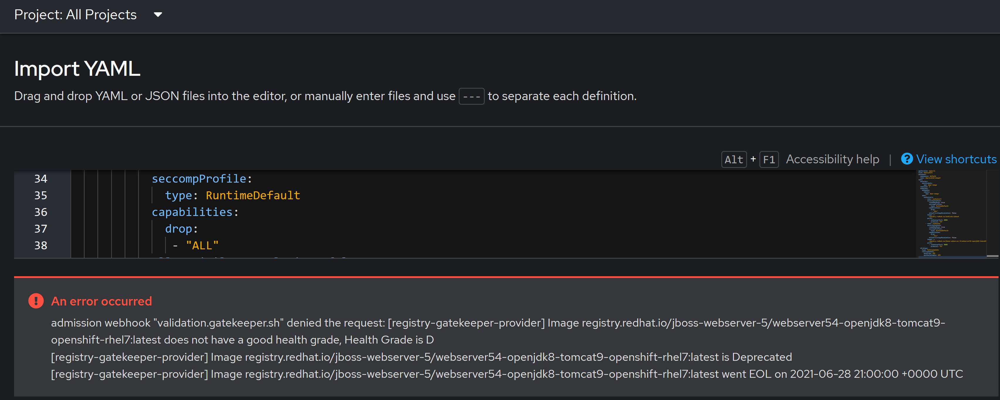
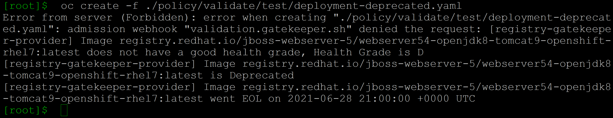
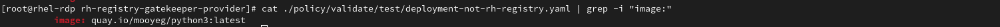
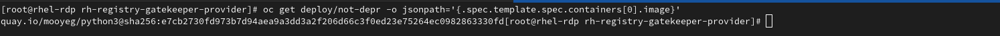

# rh-registry-gatekeeper-provider
Repository provides an example of using the [externaldata functionality of Gatekeeper](https://open-policy-agent.github.io/gatekeeper/website/docs/next/externaldata/#providers-maintained-by-the-community) to wrap the Red Hat Registry and other Red Hat tools.

Examples provided below will use the Red Hat Registry API(Pyxis) to validate:
- If an Image being pulled from the Registry is Deprecated
- if an Image being pulled from the Regisry is End of Life
- If an Image being pulled from the Registry has a poor freshness grade

Example provided below will wrap the skopeo cli to:
- Mutate a deployment image if it has a tag to using a digest.

## Requirements
- Requires Gatekeeper 3.11+
- Was tested on OpenShift 4.13
- The [OCP Gatekeeper operator](https://github.com/stolostron/gatekeeper-operator) does not seem to create the Provider CRD. That has to be manually added/created.
- Gatekeeper Installed

## Optional Steps
As mentioned above the [OCP Gatekeeper operator](https://github.com/stolostron/gatekeeper-operator) does not seem to create the Provider CRD. You can build your own version of the operator from the [github link](https://github.com/stolostron/gatekeeper-operator) and include the provider CRD. I also provide mine(Gatekeeper 3.11)

- To create operator using my edited image
 ```bash
 oc adm new-project openshift-gatekeeper-system
 oc create -f ./operator/install
 oc create -f ./operator/gatekeeper
 ```

## Steps
We will be enabling our Providers with mTLS and using the [Internal OpenShift Service CA](https://docs.openshift.com/container-platform/4.13/security/certificates/service-serving-certificate.html#add-service-serving) to generate the provider certificates.

- Create Provider Services. Our service is annotated with the service-ca annotation for cert generation.This should create a Configmap with the service-ca called openshift-service-ca.crt and tls certs in a secret called rh-registry-gatekeeper-provider-tls.

    ```bash
    oc create -f ./manifest/service/service.yaml
    ```

-  Obtain the Service CA and use it to create the Provider
   
   ```bash
   export SERVICE_CA_BUNDLE=$(oc extract -n openshift-gatekeeper-system configmap/openshift-service-ca.crt --to=- | base64 | tr -d '\n')
   ```

   ```bash
   cat manifest/provider-mutate.yaml | envsubst | oc create -f -
   ```

   ```bash
   cat manifest/provider-validate.yaml | envsubst | oc create -f -
   ```

   ```bash
   unset SERVICE_CA_BUNDLE
   ```

- Create our provider deployment. Deployments the gatekeeper-webhook-server-cert CA cert from the gatekeeper install example. If CA is different please change secret.

    ```bash
    oc create -f ./manifest/deployment.yaml -n openshift-gatekeeper-system
    ```

With our provider installed we can try a few use cases

1 Don't allow Deprecated Images to Run
  
  - Create Our Gatekeeper Template.
    ```bash
    oc create -f ./policy/validate/template.yaml
    ```

  - Create Our Gatekeeper Constraint
    ```bash
    oc create -f ./policy/validate/constraint.yaml
    ```

  - With Our Constraint and Template Created, Creating a deployment with a deprecated image from a Red Hat Registry should cause violations 
    ```bash
    oc create -f ./policy/validate/test/deployment-deprecated.yaml
    ```
    UI Violation
    
    
    CLI Violation
    

  - Provider/Template were written in way to still work if image is not from RH registry. So creating below deployment should work fine.
    ```bash
    oc create -f ./policy/validate/test/deployment-not-rh-registry.yaml
    ```

2 Mutating tag to digest's. As an example our Provider also embeds the skopeo command line and will use attempt to use that to obtain the digest.

  - Create our Gatekeeper mutation template
  ```bash
  oc create -f ./policy/mutate/assign.yaml  
  ```

  - Confirm Image Name from sample deployment
  ```bash
  cat ./policy/validate/test/deployment-not-rh-registry.yaml | grep -i "image:"
  ```
  

  - Create Deployment from sample deployment
  ```bash
  oc create -f ./policy/validate/test/deployment-not-rh-registry.yaml  
  ```

  - Confirm Mutation worked by checking image name
  ```bash
  oc get deploy/not-depr -o jsonpath='{.spec.template.spec.containers[0].image}'
  ```
  


### Clean Up Deployed Artifacts
```bash
 oc delete -f ./policy/validate
 oc delete -f ./manifest/deployment.yaml -n openshift-gatekeeper-system
 cat manifest/provider-validate.yaml | envsubst | oc delete -f -
 cat manifest/provider-mutate.yaml | envsubst | oc delete -f -
 oc delete -f ./manifest/service/service.yaml

```

## Notes
- Code does not yet integrate a cache which will result in a significant amount of calls to API. Next version will integrate a cache.
